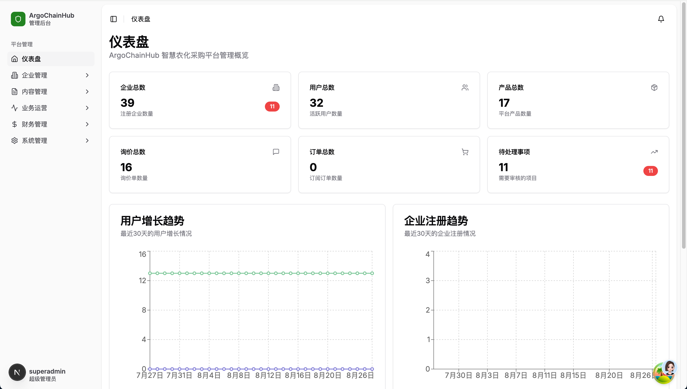
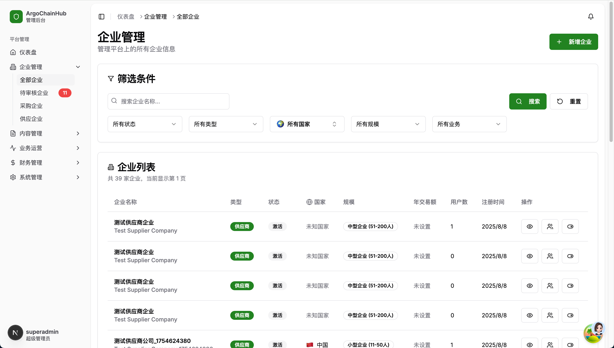
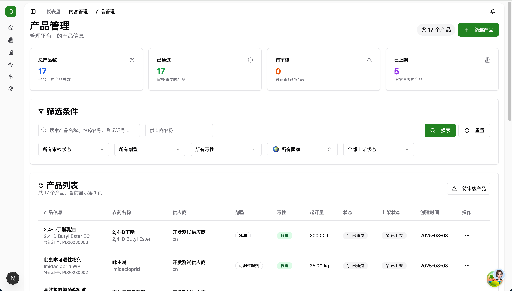
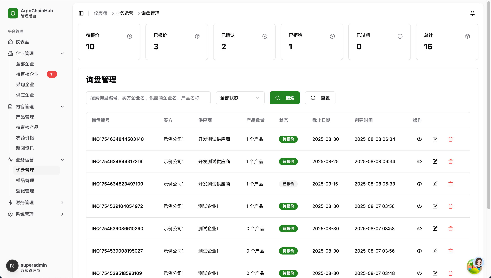
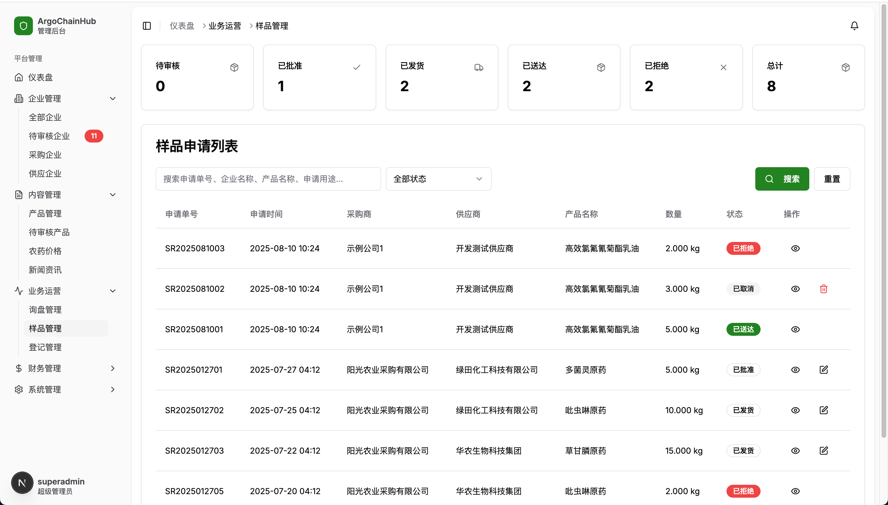
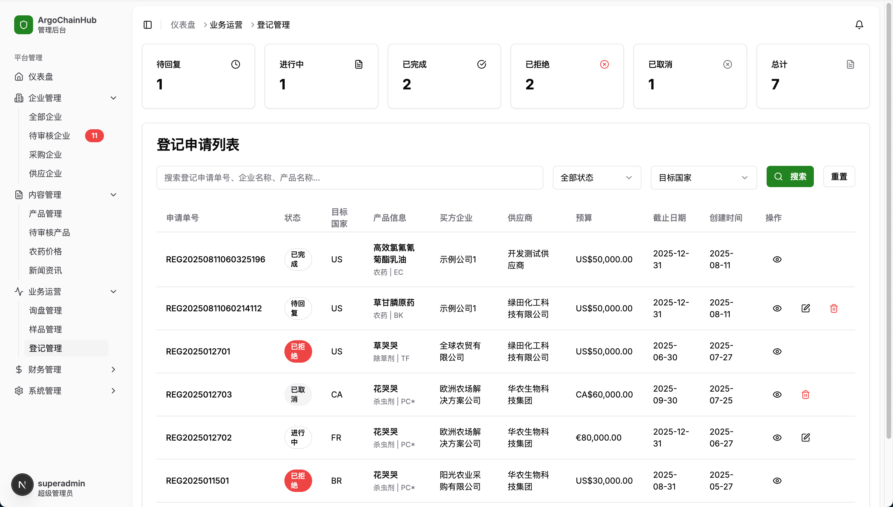
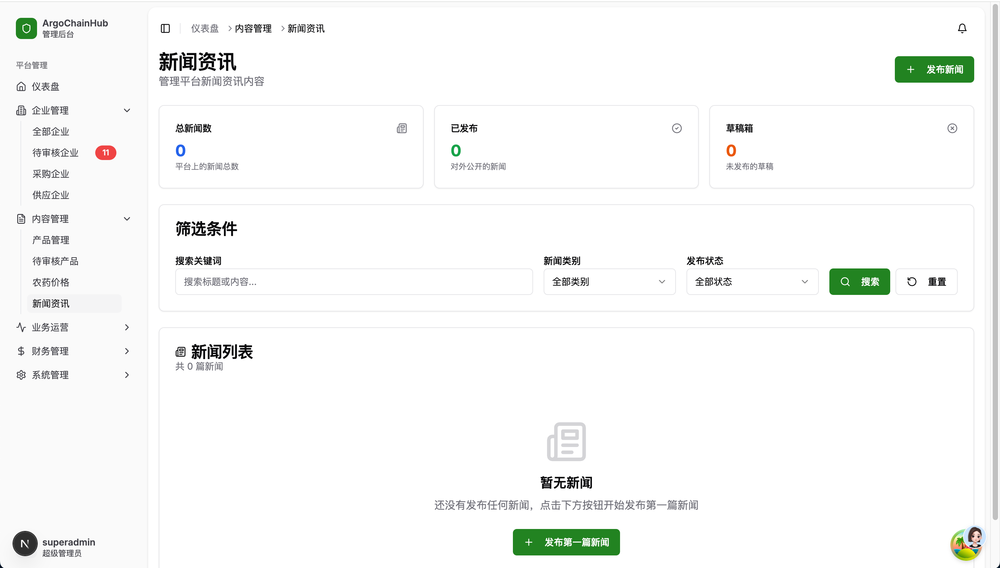
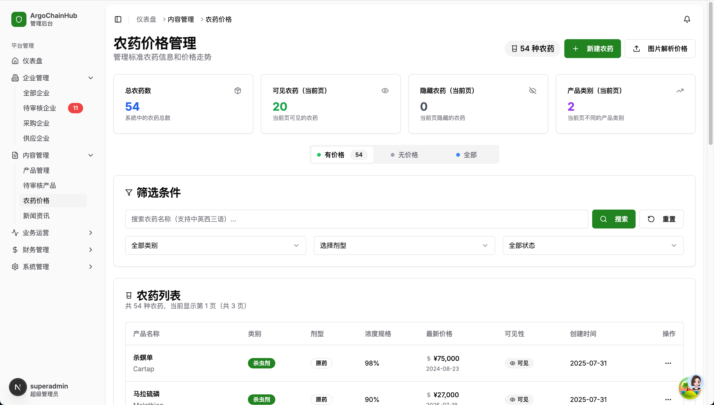
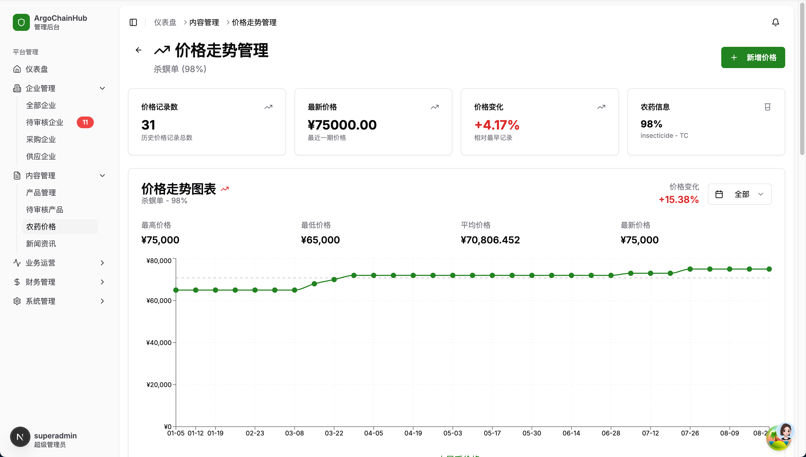
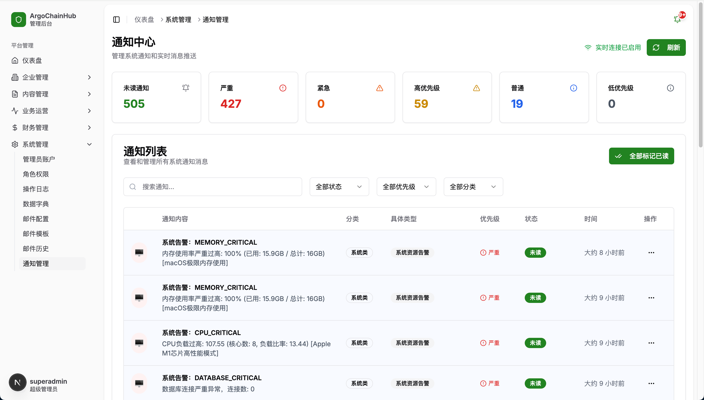

# ArgoChainHub 智慧农化采购平台管理系统

ArgoChainHub 是一个专业的智慧农化采购平台后台管理系统，为农化产品供应链提供全方位的数字化管理解决方案。系统采用现代化的 Web 技术栈构建，提供直观易用的管理界面和强大的功能模块。

在线演示地址：[https://agro-admin.wsuo.top/](https://agro-admin.wsuo.top/)

## 🌟 核心功能

### 📊 仪表盘概览
系统仪表盘提供平台关键数据的实时监控和可视化展示，帮助管理员快速掌握业务运营状况。



- **实时统计**: 企业总数、用户总数、产品数量等关键指标
- **数据趋势**: 用户增长趋势、企业注册趋势图表展示
- **待处理事项**: 一目了然的待处理任务提醒

### 🏢 企业管理
全面的企业信息管理功能，支持企业注册审核、信息维护和分类管理。



- **企业审核**: 待审核企业管理，支持审核状态跟踪
- **分类管理**: 采购企业、供应商企业分类展示
- **信息维护**: 企业详细信息查看和编辑
- **多维筛选**: 支持按状态、类型、国家、规模等条件筛选

### 📦 产品管理  
专业的农化产品信息管理系统，提供产品全生命周期管理。



- **产品审核**: 产品信息审核流程管理
- **状态跟踪**: 产品状态（待审核、已通过、等待核查、已上架）管理
- **详细信息**: 产品规格、供应商、剂型等完整信息管理
- **批量操作**: 支持产品信息的批量审核和操作

### 💼 业务运营管理

#### 询盘管理
专业的客户询盘处理系统，提升业务响应效率。



- **询盘状态**: 待报价、已报价、已确认、已拒绝等状态跟踪
- **客户信息**: 完整的询盘方和供应商信息管理
- **产品匹配**: 询盘产品数量和匹配度分析
- **时效管理**: 询盘创建时间和截止日期跟踪

#### 样品请求管理


#### 企业注册管理  


### 📰 内容管理

#### 新闻资讯管理
平台新闻内容的发布和管理系统。



- **内容编辑**: 支持富文本新闻内容编辑
- **发布状态**: 草稿箱和已发布内容管理
- **分类管理**: 新闻分类和标签管理

#### 农药信息管理


#### 农药价格管理


### 🔔 系统管理

#### 通知中心
强大的系统通知管理中心，支持多种通知类型和优先级管理。



- **通知分类**: 系统级、严重、高优先级、普通、低优先级等分类
- **实时推送**: 支持实时通知推送和消息提醒
- **状态管理**: 未读、已读通知状态跟踪
- **批量操作**: 支持批量标记已读等操作

## 🛠️ 技术栈

- **前端框架**: Next.js 15 + React 19
- **开发语言**: TypeScript
- **样式框架**: Tailwind CSS
- **UI 组件**: Radix UI + Shadcn/ui
- **状态管理**: TanStack Query (React Query)
- **表单处理**: React Hook Form + Zod
- **图表组件**: Recharts
- **实时通信**: Socket.io
- **HTTP 客户端**: Axios
- **包管理器**: pnpm

## 🚀 快速开始

### 环境要求
- Node.js >= 18
- pnpm >= 8

### 安装依赖
```bash
pnpm install
```

### 开发环境启动
```bash
pnpm dev
```
项目将在 http://localhost:3060 启动

### 构建生产版本
```bash
pnpm build
```

### 启动生产服务
```bash
pnpm start
```

## 📡 API 配置

后端 API 服务地址: http://localhost:3050/api/v1

API 配置文件位置: `lib/config.ts`

## 🧪 测试

### 运行测试
```bash
pnpm test
```

### 监听模式测试
```bash
pnpm test:watch
```

### 测试覆盖率
```bash
pnpm test:coverage
```

## 📁 项目结构

```
├── app/                    # Next.js App Router 页面
│   ├── business/          # 业务运营页面
│   ├── content/           # 内容管理页面
│   ├── enterprises/       # 企业管理页面
│   ├── finance/           # 财务管理页面
│   └── system/            # 系统管理页面
├── components/            # 可复用组件
│   ├── ui/               # 基础 UI 组件
│   ├── enterprise/       # 企业相关组件
│   ├── product/          # 产品相关组件
│   └── pesticide/        # 农药相关组件
├── hooks/                # 自定义 Hooks
├── lib/                  # 工具库和配置
├── contexts/             # React Context
├── tests/                # 测试文件
└── public/               # 静态资源
```

## 🎨 设计规范

### 主题色彩
- 主题色: `#47AC48` (绿色)
- 使用方式: `bg-primary`, `text-primary`, `border-primary`
- 变体: `bg-primary/10`, `text-primary/70`

### 组件规范
- 使用 Radix UI 作为基础组件库
- 遵循 Shadcn/ui 设计系统
- 支持深色/浅色主题切换

## 📊 核心特性

### 🔄 实时数据同步
- WebSocket 连接支持实时数据更新
- 通知系统实时推送
- 数据状态自动同步

### 🌐 国际化支持
- 多语言内容管理
- 国家/地区选择器
- 本地化数据处理

### 🛡️ 权限管理
- 基于角色的访问控制
- 页面级权限控制
- API 接口权限验证

### 📱 响应式设计
- 移动端适配
- 平板端优化
- 桌面端完整功能

## 🔧 开发指南

### 代码规范
- 使用 TypeScript 严格模式
- 遵循 ESLint 规则
- 使用 Prettier 格式化代码

### 组件开发
- 优先使用现有组件库
- 遵循组件复用原则
- 使用字典系统管理下拉选项数据

### API 集成
- 使用统一的 API 客户端
- 分页接口使用 `getWithMeta`
- 单条记录使用 `get` 方法

## 📈 性能优化

- 组件懒加载
- 图片优化压缩
- 代码分割
- 缓存策略优化

## 🤝 贡献指南

1. Fork 项目仓库
2. 创建功能分支 (`git checkout -b feature/amazing-feature`)
3. 提交更改 (`git commit -m 'Add some amazing feature'`)
4. 推送到分支 (`git push origin feature/amazing-feature`)
5. 创建 Pull Request

## 📄 许可证

本项目采用私有许可证，仅供内部使用。

## 🆘 技术支持

如需技术支持，请联系开发团队或查看项目文档。

---

**ArgoChainHub 管理系统** - 让农化采购更智慧，让管理更高效！